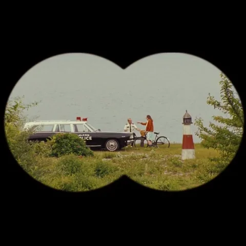

<h1 align="center">Nice to meet you, I'm Chiara</h1>

  <b>UX/UI Designer</b> · Interaction Designer · AI Product Designer

  
  
  
  

 

## About me

End-to-end UX/UI designer working across AI, EdTech, robotics, accessibility, and cultural education.

- **I do**: 0→1 product design (research → strategy → UI)
- **I’m strong in**: prototyping · design systems · accessibility (WCAG) · UX for AI
- **Team player**: collaborative, clear, and kind — I love working with cross-functional teams
- **Community**: IxDF Sydney Local Leader · W3C Invited Expert (a11y)

## Career snapshot (recruiter-friendly)

<table>
  <tr>
    <th align="left">Scope</th>
    <th align="left">Focus areas</th>
    <th align="left">Strengths</th>
    <th align="left">Community</th>
  </tr>
  <tr>
    <td>End-to-end UX/UI · 0→1 product design</td>
    <td>AI · EdTech · Robotics · Accessibility · Cultural education</td>
    <td>Prototyping · Design systems · WCAG · UX for AI</td>
    <td>IxDF Sydney Local Leader · W3C Invited Expert (a11y)</td>
  </tr>
</table>

## Background

End-to-end User Experience Designer @ **Kazocos.ai** — R&amp;D and product UX across ISO 9241-210 research, design systems, AI/climate and instrument/analytics settings, and W3C Invited Expert work on accessibility (APA).  

International experience across Europe, Asia, Australia, the Americas, and a cultural initiative in Africa — from large-scale usability testing and high-fidelity prototyping to delivery with accessibility and systems thinking.

## My approach to the project

<table align="center">
  <tr>
    <td align="center" valign="top">
      
       
      <b>Team player</b>
    </td>
    <td align="center" valign="top">
    
       
      <b>Kindness is a superpower</b>
    </td>
    <td align="center" valign="top">
      
       
      <b>Human-centred</b>
    </td>
    <td align="center" valign="top">
      
       
      <b>Sprints are fine; consistency wins</b>
    </td>
  </tr>
</table>

## Skills

<table>
  <tr>
    <th align="left">Area</th>
    <th align="left">Details</th>
  </tr>
  <tr>
    <td><b>UX research</b></td>
    <td>Interviews &amp; synthesis · Usability testing (mod/unmod) · Workshops · ISO 9241-210 aligned practice</td>
  </tr>
  <tr>
    <td><b>UX methods</b></td>
    <td>IA · Journey maps · Service flows · Concept validation · Evaluation frameworks</td>
  </tr>
  <tr>
    <td><b>UI / product design</b></td>
    <td>Wireframes → hi-fi prototypes · Responsive UI · Design systems · Handoff specs</td>
  </tr>
  <tr>
    <td><b>Accessibility</b></td>
    <td>Inclusive reviews · WCAG-informed design · Accessibility-first thinking</td>
  </tr>
  <tr>
    <td><b>AI + emerging tech</b></td>
    <td>Human–AI interaction · AI-assisted ideation/evaluation · Prompt/prototype experiments</td>
  </tr>
  <tr>
    <td><b>Prototyping</b></td>
    <td>AR/interactive · Hardware/experience prototyping (as needed)</td>
  </tr>
  <tr>
    <td><b>Frontend (basic)</b></td>
    <td>HTML/CSS · WordPress · Basic JavaScript · React basics</td>
  </tr>
  <tr>
    <td><b>Data viz (basic)</b></td>
    <td>RAWGraphs</td>
  </tr>
</table>

## Tools

<table>
  <tr>
    <th align="left">Design</th>
    <th align="left">Collaboration</th>
    <th align="left">Build / prototype</th>
    <th align="left">API / docs</th>
    <th align="left">Handoff</th>
    <th align="left">AI prototyping</th>
  </tr>
  <tr>
    <td>Figma · FigJam · Adobe CC · Framer · ProtoPie</td>
    <td>Miro · Notion · Google Workspace · Jira · Trello</td>
    <td>Unity 3D · Rhino · Arduino (as needed)</td>
    <td>Swagger</td>
    <td>GitHub · WordPress · HTML · CSS</td>
    <td>ChatGPT · Cursor · Claude · GitHub Copilot</td>
  </tr>
</table>

## What I'm working on

- AI-powered, accessible product experiences
- Scalable UX/UI systems for complex platforms
- Small UX experiments & prototypes on GitHub
